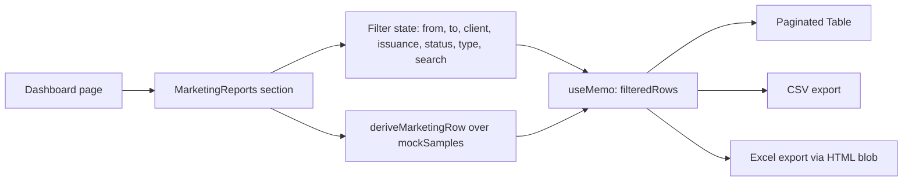
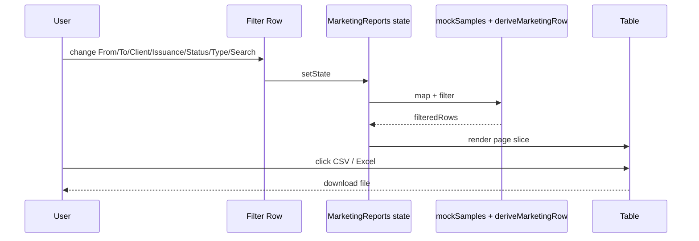

## Plan: Dashboard Marketing Reports Segment

Add a `MarketingReports` segment to `src/pages/dashboard.tsx` that mirrors the screenshot — a filter card on top and a paginated table of samples below — and reuse the existing sample mock data so the data shape stays consistent with the rest of the app.

**TL;DR**
- One new component `MarketingReports.tsx` rendered inside the Dashboard below the existing charts.
- Two new mock-data helper fields (computed) for delivery date, due date, days-left, and progress percentage derived from `MockSample` (`receivedDate`, `priority`, `completedDate`, `status`, `tests[].parameters`).
- Reuse existing `Select`, `Input`, `Button`, `Table`, `StatusBadge` UI primitives — no new dependencies.

**Steps**
1. Extend `MockSample` shape with optional UI-only computed fields (delivery date, due date, days remaining, progress %) — keep them as a derived view, not stored, to avoid touching the seed array. (parallel with 2)
2. Add a small helper in `src/mock-data/samples.ts` (`deriveMarketingRow`) that takes a `MockSample` and returns the row used by the table. (parallel with 1)
3. Create `src/components/dashboard/MarketingReports.tsx`:
   - State: `fromDate`, `toDate`, `clientFilter` ("-- All Clients --"), `issuanceFilter` (All / Issued / Pending), `statusFilter`, `typeFilter`, `search`, `page`, `pageSize` (default 10).
   - Derive dropdown options from `mockClients`, distinct `status`/`sampleType` values of `mockSamples`.
   - Apply all filters with `useMemo` over `mockSamples.map(deriveMarketingRow)`.
   - Render filter row in a `Card` exactly matching the screenshot layout (4-col grid: From/To on row 1, Client/Report Issuance on row 2, Status/Type/Search on row 3) and a primary "Search" button.
   - Render a `Table` with columns: Sample#, Client Name, Sample Type, Performed Parameters (comma-joined test names + parameter counts), Date Received, Sample delivery to the LAB (receivedDate), Due Date (receivedDate + priority days), Now (today's date), Days (`differenceInCalendarDays(now, dueDate)`), Progress (progress bar computed from `tests[].parameters` pass count).
   - Export CSV + Excel buttons (`XLSX` is not in package.json — use CSV only, and an HTML table trick for Excel export to avoid a new dependency).
   - Pagination: "Show N entries" + per-page select, plus Prev/Next page buttons, matching `DataTable` style.
   - Localize via existing `isRtl` + `language` from `AppContext` and mirror the Arabic strings used by `dashboard.tsx`.
4. Wire it into `src/pages/dashboard.tsx`: import and render `<MarketingReports />` as the last section, after the "Recent Activity / Revenue by Test Type" grid.
5. Register a new sidebar/menu entry is **not** required — the screenshot shows it as a section of the Dashboard, not a separate page.

**Relevant files**
- `src/pages/dashboard.tsx` — render the new `<MarketingReports />` at the bottom of the returned JSX.
- `src/components/dashboard/MarketingReports.tsx` — new file containing the filters + table.
- `src/mock-data/samples.ts` — add `deriveMarketingRow` helper and export it; keep `MockSample` unchanged.
- `src/components/ui/select.tsx`, `src/components/ui/input.tsx`, `src/components/ui/button.tsx`, `src/components/ui/table.tsx`, `src/components/ui/card.tsx` — reuse existing primitives.
- `src/components/shared/StatusBadge.tsx` — reuse for the Status column.
- `src/context/AppContext.tsx` — consume `language` to drive RTL labels.
- `package.json` — no change (CSV-only export keeps zero new deps).

**Diagrams**

**Verification**
1. `pnpm run typecheck` — passes (no new TS errors).
2. `pnpm run build` — succeeds.
3. Manual: open `/dashboard`, change each filter, confirm row count and columns update; verify CSV and Excel downloads contain the currently filtered rows; verify Arabic labels render when language is switched via the header toggle.
